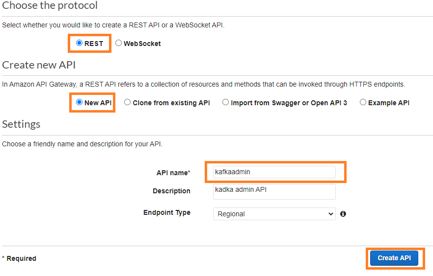
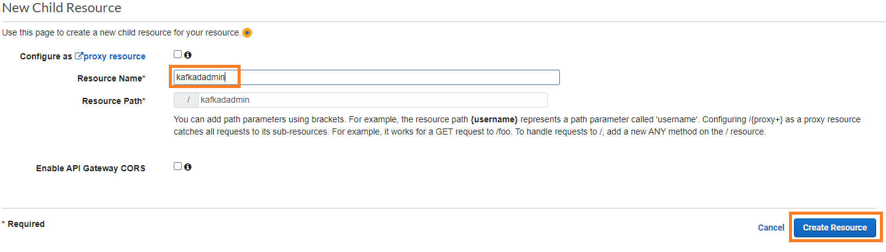
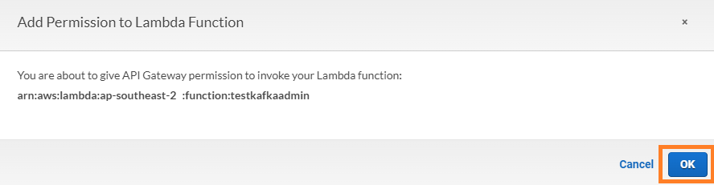

# Using API Gateway and Lambda with Amazon MSK for kafkaAdmin operations
Here is an example to connect with Amazon MSK using API Gateway and Lambda for Kafka admin operation (i.e. Create topic, list topics, describe topic).

## Prerequisite
* A MSK cluster with [Plaintext](https://docs.aws.amazon.com/msk/latest/developerguide/create-cluster.html) authentication

## Create a Lambda layer
Follow the below steps to create a Lambda layer with [kafka-python](https://kafka-python.readthedocs.io/en/master/) client.
1. Create a folder called python on your local machine.
```
mkdir python
cd python
```
2. Run the following command from commandline. This will download all the required packages on the folder you created earlier.
```
pip install -t . kafka-python
```

3. Zip the folder

4. Run the below command using [aws cli](https://aws.amazon.com/cli/) to create the Lambda layer
```
aws lambda publish-layer-version --layer-name kafkaadmin --description "My layer" --zip-file fileb://python.zip --compatible-runtimes python3.6 python3.7 python3.8 
```

5. Note down the LayerARN. Sample:
```
"LayerArn": "arn:aws:lambda:ap-southeast-2:11111111111:layer:kafkaadmin"
```


## Create a Lambda function to connect with your MSK cluster
To connect with your MSK cluster inside a VPC, your Lambda function must have execution role permissions as described [here](https://docs.aws.amazon.com/lambda/latest/dg/configuration-vpc.html). Create a role and specify the role arn while creating the lambda function. Specify the subnets and security group of your MSK cluster. This example works with Plaintext authentication.
1. Download the python script [lambda_function.py](lambda_function.py) and zip the file.
2. Create a Lambda funciton using aws cli as below.
```
aws lambda create-function \
--function-name REPLACE-FUNCTION-NAME \
--runtime python3.8 \
--role arn:aws:iam::11111111111:role/REPLACE-ROLE-ARN \
--handler lambda_function.lambda_function \
--zip-file fileb://lambda_function.zip \
--vpc-config SubnetIds=REPLACE-SUBNET-1,REPLACE-SUBNET-2,REPLACE-SUBNET-3,SecurityGroupIds=REPLACE-SG-000000 \
--layers arn:aws:lambda:ap-southeast-2:11111111111:layer:REPLACE-LAYER-ARN
```


## Create an API
1. Go to the API Gateway console: https://console.aws.amazon.com/apigateway.
2. Click the "Create API" button.
3. Choose REST API and click on Build.
4. In the "New API" wizard, enter a name and description for your API.
5. Choose "REST" as the protocol for your API.
6. Click the "Create API" button.

7. In the "Resources" pane, click the "Actions" dropdown and choose "Create Resource".
8. In the "New Resource" dialog, enter a resource name (kafkaadmin) and click the "Create Resource" button

9. Select the newly created resource. In the "Actions" dropdown for the new resource, choose "Create Method".
10. Choose "ANY" and click on save.

11. Select "Lambda Function" as the integration type. Check "Use Lambda Proxy integration".
12. Enter the Lambda function name that you created earlier and click the "Save" button.

13. Select "OK" to add invoke permission for the Lambda function.



## Deploy the API
1. Click the "Deploy API" button in the "Actions" dropdown to deploy your API.
2. In the "Deploy API" dialog, choose a deployment stage (e.g. test, prod) and click the "Deploy" button.

## Test your API
1. Get the invoke URL and try below


## List topics 
To list all the topics of your Kafka cluster enter the below URL on your browser:

```
REPLACE-WITH-INVOKE-URL/kafkaadmin?whichfunction=listtopics&bsrv=REPLACE-BOOTSTRAP-BROKERS
```

** To get the bootstrap brokers name for MSK, follow [MSK documentation](https://docs.aws.amazon.com/msk/latest/developerguide/msk-get-bootstrap-brokers.html)

*Sample output:*


## Describe topic:
To describe a topic enter the below URL on your browser:

REPLACE-WITH-INVOKE-URL/kafkaadmin?whichfunction=describetopic&bsrv=REPLACE-BOOTSTRAP-BROKERS&topicname=REPLACE-TOPIC-NAME

*Sample output:*


## Describe topic config:
To describe a topic config enter the below url on your browser:
```
REPLACE-WITH-INVOKE-URL/kafkaadmin?whichfunction=gettopicconfig&bsrv=REPLACE-BOOTSTRAP-BROKERS&topicname=REPLACE-TOPIC-NAME
```

*Sample output:*


## Create a tiered storage enabled topic:
Assuming you are using a tiered storage enabled cluster. To create a [tiered storage](https://docs.aws.amazon.com/msk/latest/developerguide/msk-tiered-storage.html) enabled topic on MSK, enter the below URL on your browser. This will create a tiered storage enabled topic with 259200000ms total retention, 3600000ms location retention, 10 partitions and a replication factor of 2:

```
REPLACE-WITH-INVOKE-URL/kafkaadmin?whichfunction=createtopic&bsrv=REPLACE-BOOTSTRAP-BROKERS&topicname=REPLACE-TOPIC-NAME&retention=259200000&localretention=3600000&partition=10&rf=2
```

## Create a non-tiered storage topic:
To create a Kafka topic without tiered storage on MSK, enter the below URL on your browser. This will create a Kafka topic with 259200000ms data retention, 10 partitions and a replication factor of 2. The create topic API only enables tiered storage feature if local retention is lower than overall topic retention:

```
REPLACE-WITH-INVOKE-URL/kafkaadmin?whichfunction=createtopic&bsrv=REPLACE-BOOTSTRAP-BROKERS&topicname=REPLACE-TOPIC-NAME&retention=259200000&localretention=259200000&partition=10&rf=2
```

*Sample output:*


